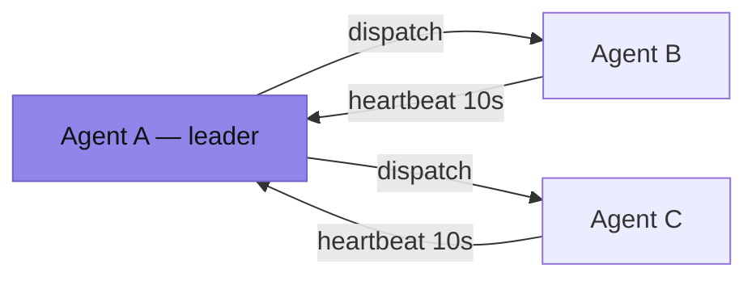

# Hop

Lightweight cluster orchestrator in Go. Simple alternative to Nomad.

## Features

- **Multi-instance jobs**: Deploy N copies with automatic spreading
- **Smart scheduling**: Round-robin with capacity-aware placement
- **Node affinity**: Target jobs to specific nodes via attribute constraints
- **Docker support**: Run containers alongside processes (via `docker` CLI)
- **Job updates**: Rolling, recreate, or blue-green deployments
- **Named ports**: Flexible port allocation per service
- **Service discovery**: Tags for external load balancers
- **Health checks**: HTTP, TCP, and file-based monitoring with failure threshold and auto-restart
- **Live log streaming**: Real-time stdout/stderr via SSE (no persistence)
- **Artifact downloads**: HTTP and S3 with extraction support (tar.gz, tar.bz2, zip, raw binary)
- **Platform-specific artifacts**: Multiple artifacts per job, agent picks first matching
- **Volume mounts**: Host paths symlinked into task directories
- **Fault tolerance**: Automatic failover on node crashes with settle period
- **Resource limits**: CPU shares and memory limiting
- **State persistence**: Jobs survive agent restarts
- **Process isolation**: Optional chroot (Linux) / sandbox (macOS)
- **Web UI**: Hosted dashboard at [gui.gethop.org](https://gui.gethop.org) — talks to your agent directly, no self-hosting required

## Quick Start

### Build

```bash
go build -o bin/agent ./cmd/agent
go build -o bin/run ./cmd/cli
```

### Run Standalone

```bash
./bin/agent --standalone --cluster=dev
```

### Deploy Job

```bash
# Single instance (process)
./bin/run apply --name web --command "python app.py"

# Docker container
./bin/run apply --name redis --image redis:7 --command "redis-server"

# With artifact and resource limits
./bin/run apply \
  --name api \
  --command "./server" \
  --artifact "s3://bucket/app-v1.2.tar.gz" \
  --cpu 2000 \
  --memory 512M

# With node affinity (only deploy on arm64 nodes)
./bin/run apply --name api --command "./api" --affinity node.arch=arm64

# Platform-specific artifacts
./bin/run apply --name app --command "./app" \
  --artifact "node.arch=amd64::https://example.com/app-amd64.tar.gz" \
  --artifact "node.arch=arm64::https://example.com/app-arm64.tar.gz"
```

### Update Job (Upsert)

**Same command** - POST with existing job name triggers update:

```bash
# Update to new version (rolling by default - zero downtime)
./bin/run apply --name api --command "./server-v2"

# Update with specific policy
./bin/run apply --name api --command "./server-v2" --update-policy recreate

# Blue-green deployment
./bin/run apply --name api --command "./server-v2" --update-policy blue-green
```

#### Update Policies

| Policy | Downtime | Resources | Use Case |
|--------|----------|-----------|----------|
| **rolling** (default) | None | Normal | Standard updates, zero downtime |
| **recreate** | Yes | Minimal | Database migrations, breaking changes |
| **blue-green** | None | 2x during switch | Canary testing, instant rollback |

## Web UI

A hosted dashboard lives at **[gui.gethop.org](https://gui.gethop.org)** — you don't
have to host anything. Open it, enter your agent's address (and API key if auth is
enabled), and manage jobs, agents, capacity and live logs from the browser.

It's a static page: your browser talks to your agent **directly**, signing each
request with the same HMAC scheme as the CLI, so your cluster data never passes
through gethop.org. The agent just needs to be reachable from your browser (CORS is
already enabled on it).

**Browser note (LAN clusters):** when the hosted GUI (a public origin) reaches a
private/LAN address, Chrome gates the request behind *Private Network Access* —
the agent answers the preflight (`Access-Control-Allow-Private-Network: true`),
and Chrome may show a one-time "access devices on your local network" prompt.
Since the hosted GUI is served over HTTPS, plain-HTTP LAN endpoints can also be
blocked as mixed content — in that case use a localhost agent, a TLS-terminated
endpoint, or self-host the GUI inside the LAN.

Prefer to self-host? The GUI is a single `index.html` + `app.js` (the `hop-gui`
project) — serve it from anywhere, or open the file locally.

## Architecture



- **Leader**: Dispatches jobs, monitors agent health, reconciles on changes
- **Agents**: Run tasks, report status, auto-restart failures
- **Registration**: Agents register with `placed` counts on startup/leader change
- **Settle period**: New leader waits 30s before reconciling to let agents register
- **Deterministic round-robin**: Spreading across nodes (agents sorted by ID)
- **Capacity-aware**: Agents reject when full, leader tries next
- **Affinity**: Agents check job constraints, reject with 406 on mismatch (leader stays unaware)

## Job Spec

```json
{
  "name": "api-service",
  "command": "./server --http=$ER_PORT_HTTP",
  "count": 3,
  "affinity": {"node.arch": "arm64"},
  "artifacts": [
    {
      "url": "s3://bucket/app-arm64.tar.gz",
      "match": {"node.arch": "arm64"},
      "auth": {"access_key": "...", "secret_key": "...", "region": "eu-west-1"},
      "extract": "tar.gz"
    },
    {
      "url": "s3://bucket/app-amd64.tar.gz",
      "match": {"node.arch": "amd64"},
      "auth": {"access_key": "...", "secret_key": "...", "region": "eu-west-1"},
      "extract": "tar.gz"
    }
  ],
  "ports": {"http": 0, "grpc": 0},
  "cpu_shares": 2048,
  "memory_limit": 536870912,
  "env": {"DB_HOST": "postgres.internal"},
  "tags": {"service": "api", "hoplb-urlprefix": "*.api.example.com"},
  "volumes": {"/data/shared": "data"},
  "health_check": {
    "type": "http",
    "path": "/health",
    "port": "http",
    "timeout": "5s",
    "initial_timeout": "30s",
    "failure_threshold": 3
  },
  "max_restarts": 5,
  "update_policy": "rolling"
}
```

### Fields

- **name**: Job identifier (unique key for upsert)
- **command**: Command to execute (always required in current API)
- **count**: Number of instances (default 1, -1 = all agents). API-only, not available via CLI.
- **driver**: `"exec"` (default), `"docker"`, or `"hop"` (HopOS) — auto-derived from `image` if not set
- **image**: Docker image (sets driver to `"docker"` automatically)
- **affinity**: Node attribute constraints (AND logic). Example: `{"node.arch": "arm64"}`. Pin to node: `{"node.id": "node-1"}`. Agent rejects with 406 if no match.
- **artifacts**: Platform-specific binaries/assets (optional). Agent picks first matching entry.
  - **url**: Download URL - scheme determines downloader (http://, https://, s3://)
  - **match**: Node attribute constraints — agent picks first artifact where all match (empty = catch-all)
  - **headers**: HTTP headers map (Authorization, X-API-Key, etc.)
  - **auth**: Credentials (S3: access_key/secret_key/region, HTTP: username/password for Basic Auth)
  - **extract**: Archive type — `tar.gz`, `tar.bz2`, `zip`, or `""` (raw binary, auto chmod +x)
- **ports**: Process: port name -> host port (0=dynamic, >0=fixed). Docker: port name -> container port (host always dynamic). ENV vars `ER_PORT_<NAME>`
- **cpu_shares**: CPU priority (nice-based, higher = more CPU time)
- **memory_limit**: Memory limit in bytes
- **env**: Environment variables (note: node attributes are auto-injected as `ER_ATTR_<KEY>`, user env takes priority)
- **tags**: Labels for service discovery / grouping
- **volumes**: Host path -> task path mappings (symlinked into task directory)
- **health_check**: Health check config (optional)
  - **type**: `"http"` (default), `"tcp"`, or `"file"`
  - **path**: HTTP endpoint path or absolute file path (for file checks)
  - **port**: Named port to check (http/tcp, default "http")
  - **timeout**: Request/connect timeout (http/tcp, default 5s)
  - **initial_timeout**: Grace period after start to become healthy (default 30s)
  - **failure_threshold**: Consecutive failures before restart (default 3)
- **max_restarts**: Max restart attempts — omit for the default of 5, `0` = no restarts, `-1` = unlimited
- **update_policy**: rolling (default), recreate, or blue-green

## Named Ports

```json
{
  "command": "./server --http=:$ER_PORT_HTTP --metrics=:$ER_PORT_METRICS",
  "ports": {"http": 0, "metrics": 0}
}
```

Task gets:
```bash
ER_PORT_HTTP=54321
ER_PORT_METRICS=54322
```

**No ports = no ports:** Jobs without `ports` field get no port ENV vars.

## Artifact Downloads

URL scheme determines downloader. `extract` field determines extraction method.

```json
{"artifacts": [{"url": "s3://bucket/app.tar.gz", "extract": "tar.gz"}]}
{"artifacts": [{"url": "https://example.com/app.zip", "extract": "zip"}]}
{"artifacts": [{"url": "https://example.com/binary"}]}
```

Empty `extract` = raw file download with chmod +x (single binary).

Platform-specific: use `match` to target node attributes (agent picks first matching entry):
```json
{
  "artifacts": [
    {"url": "https://example.com/app-arm64", "match": {"node.arch": "arm64"}},
    {"url": "https://example.com/app-amd64", "match": {"node.arch": "amd64"}}
  ]
}
```

## Volume Mounts

```json
{
  "volumes": {
    "/host/data": "data",
    "/host/config": "config"
  }
}
```

Host paths are symlinked into the task's working directory.

## Live Log Streaming

```bash
# Via CLI
./bin/run logs <task-id>                    # stdout
./bin/run logs <task-id> --stream stderr    # stderr

# Via API
curl http://agent:8080/logs/{task-id}/stdout
```

SSE format, live stream only, no storage. Pipe to external tools for persistence.

## Fault Tolerance

### Task Failures
- Agent detects crash (monitor loop, 5s interval)
- Auto-restart locally with exponential backoff (max_restarts: default unlimited, 0 = no restarts, N = give up after N in restart_window)
- Health check failures -> kill + restart (after failure_threshold consecutive failures, default 3)

### Agent Failures
- Leader detects missing heartbeat (30s timeout)
- Cleans stale placement entries for dead agent
- Reconciles: compares desired vs actual, dispatches missing

### Leader Failover
- New leader enters settle period (30s)
- Agents register with placed counts during settle
- After settle, leader reconciles with accurate placement data

## Resource Limits

- **CPU shares**: Nice-based priority (higher shares = lower nice = more CPU time)
- **Memory limit**: Linux cgroups v2, macOS ulimit

Capacity-aware: agents have `cpu_cores * 1024` total shares and total system memory. Requests exceeding available resources are rejected (503).

## Docker Support

Run Docker containers instead of processes by setting the `image` field:

```json
{
  "name": "redis",
  "image": "redis:7",
  "command": "redis-server --maxmemory 256mb",
  "count": 3,
  "ports": {"redis": 6379}
}
```

- Driver auto-derived from `image` field (`image` set = `"docker"`)
- `command` overrides the image's CMD (always required in current API)
- `ports` values are **container ports** (host ports always dynamically allocated)
- Resource limits map to `--memory` and `--cpu-shares`
- Volumes map to `-v hostPath:containerPath`
- Container naming: `hop-<taskID>`
- Cleanup at agent start: `docker rm -f` all `hop-*` containers

## Documentation

**Start at [docs/index.md](docs/index.md)** — overview, quick start and a map of all guides:

- [architecture.md](docs/architecture.md) - System design (hoplock election, committed state, reconciliation)
- [api.md](docs/api.md) - HTTP API reference (incl. HMAC auth)
- [cli.md](docs/cli.md) - CLI commands
- [configuration.md](docs/configuration.md) - Config file options
- [data-structures.md](docs/data-structures.md) - Core types
- [lifecycles.md](docs/lifecycles.md) - Lifecycles & invariants
- [development.md](docs/development.md) - Development setup

## Design Principles

- **Simplicity over features** - KISS
- **ExecRunner + DockerRunner** — runner selected by `driver` field (auto-derived from `image`)
- **States**: queued, downloading, running, stopping, failed; stopping ends by removing the task
- **Polling over events** - 10s heartbeat, simple and robust
- **Channel-based state** - Single goroutine owns mutable state

## License

MIT
